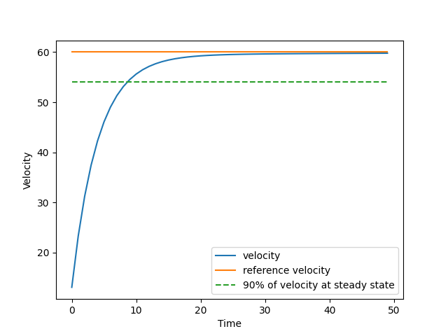

# Cruise-Controller
Implementing the concept of PID controller by designing cruise controller to reach desired velocity
## Motion Model
If the inertia of the wheels is neglected, and it is assumed that air drag(proportional to the car's speed at low speeds) is opposing the motion of the car, then the motion model is reduced to a simple first order system. \
Thus the motion of the car can be written as: 
$$m\dot{v} + bv = u$$
## Model Parameters
```python
Mass(m) = 1000 kg
Drag Coefficient(b) = 25
Desired Velocity(v) = 60 m/s
```
### Results

